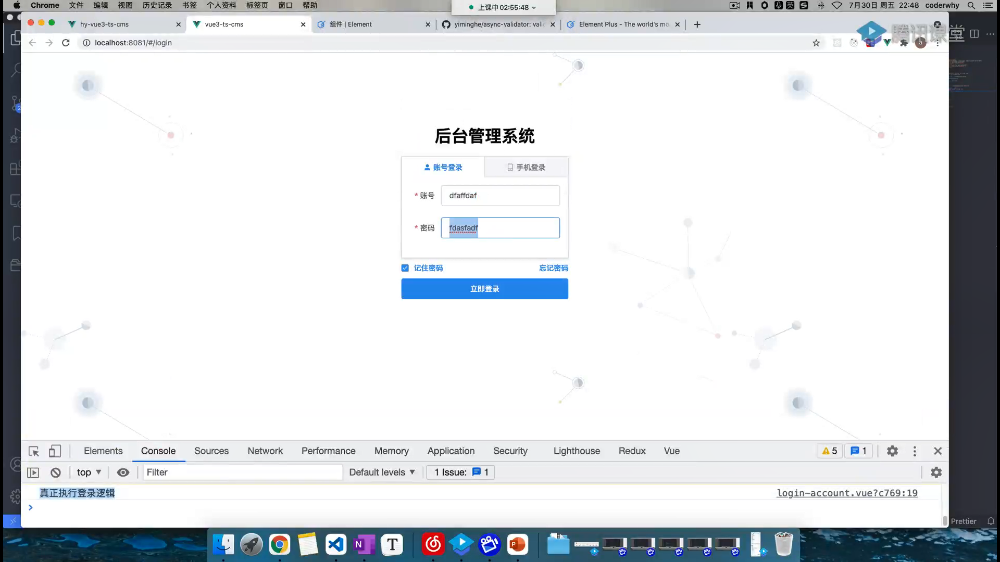
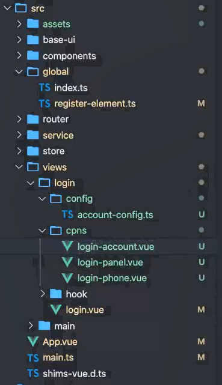

# 项目 登录页

## 登录页结构

<div align=center></div>



```md
|-- views
    |-- login
        |-- config 
            放login相关配置文件
        |-- hooks 
            放login相关使用生命周期函数或者reative的配置文件
        |-- cpns
            将login分为多个组件
            |-- login-panel.vue
                
            |-- login-account.vue 
            |-- login-phone.vue
                实现登录验证的逻辑及正则提醒

        |-- login.vue
```

## CSS重置

1. normalize.css

### Rules
```js
 rules=[
        {
          required: true,
          message: 'Please input email address',
          trigger: 'blur',
        },
        {
          type: 'email',
          message: 'Please input correct email address',
          trigger: ['blur', 'change'],
        },
   ]
```

## 实现步骤
1. 基础页面实现，样式，el组件
2. 登录的正则配置
3. 登录按键的基础逻辑
   1. 在panel中监听点击并调用account组件中的登录逻辑和方法
4. 是否记住密码
   1. localStorage的封装 in `src/utils/cache.ts`
      1. getCache()
      2. setCache()
      3. delCache()
      4. clearCache()
5. 发送网络请求
   1. 什么请求？
      1. 用户登录
         1. 验证token
         2. 或生成token
         3. 本地保存token
      2. 用户菜单（方便后续渲染
      3. 
   2. 在哪请求？
      1. **service/login**中发送请求，
      2. 因为数据是多组件公用的，所以在**store/login**中获得请求的结果
      3. 并本地保存数据（token、userInfo、userMenu
   
   3. **整体登录逻辑**
      1. 在service中写请求函数
      2. 在store中发送请求并处理数据


## problems

#### element-plus 
1. ElButton 在点击后需要点一下别的地方才恢复原样。。。
