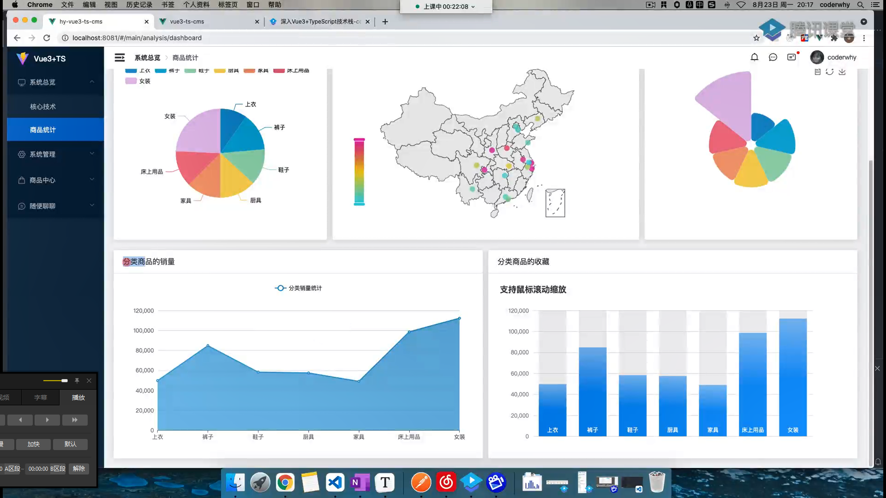
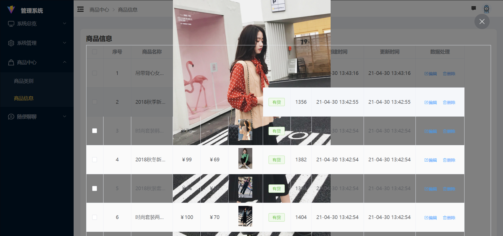

# Main


## 实现步骤

1. 基础页面结构搭建

   1. 整个的文件结构

   ```md
   |-- components

   |-- nav-main(放左侧导航栏的文件)
   |-- src
   |--nav-main.vue
   |--index.ts(主要的文件导出文件)

   |-- nav-header（头部导航栏的文件）

   |-- views
   |-- main
   |-- main.vue(主要导入文件)
   ```

   ```
        |-- config
            相关配置文件
        |-- hooks
            相关使用生命周期函数或者reative的配置文件
        |-- cpns
            分为多个组件
            |-- login-panel.vue

            |-- login-account.vue
            |-- login-phone.vue
                实现登录验证的逻辑及正则提醒
   ```

   el-plus menu 的结构

   ```html
   <!-- el-menu 里面可以写菜单相关样式，及绑定open之类操作 -->
   <el-menu>
     <el-sub-menu index="1">
       <!-- 一级菜单内容 -->
       <template #title>
         <!-- <el-icon><location /></el-icon> -->
         <span>Navigator One</span>
       </template>

       <!-- <el-menu-item-group title="Group One"> 分组 -->
       <el-menu-item index="1-1">item one</el-menu-item>
       <el-menu-item index="1-2">item two</el-menu-item>
       <!-- </el-menu-item-group> -->
       <el-menu-item index="1-3">item three</el-menu-item>
       <!-- 每个item外面套一个sub-menu代表可以展开 -->
       <el-sub-menu index="1-4">
         <template #title>item four</template>
         <el-menu-item index="1-4-1">item one</el-menu-item>
       </el-sub-menu>
     </el-sub-menu>

     <!-- 如果到达el-menu-item 就是没有展开啦 -->
     <el-menu-item index="2">
       <el-icon><icon-menu /></el-icon>
       <span>Navigator Two</span>
     </el-menu-item>

     <el-menu-item index="3" disabled>
       <!-- <el-icon><document /></el-icon> -->
       <span>Navigator Three</span>
     </el-menu-item>

     <el-menu-item index="4">
       <!-- <el-icon><setting /></el-icon> -->
       <span>Navigator Four</span>
     </el-menu-item>
   </el-menu>
   ```

## RBAC

(role base accsess control)

动态路由组件
方案：

1. 注册全部路由
2. 不同角色注册不同路由表
3. 根据菜单动态生成路由映射
   1. 在哪里配置动态路由
      1. store/router 的路由守卫都可以
   2. 在 store 中配置
      1. 先加载所有路由
         1. require.context('路径',Boolean，正则);
         2. 返回合规的文件路径，Boolean：是否递归查找
      2. 根据获取菜单选择

### 为什么配置完刷新页面就 not-found？

执行顺序：

1. vueRouter：app.user(router) -> install(){} ->获取当前 path -> router.routes ->
2. setupStore() ->注册动态路由
3. 路由守卫回调

## 页面搭建

### 搜索框组件封装

- 实现内容：

  

  - 基本样式实现

  - 可根据传入 props 配置所需表单内容
    1. 可自定义 input 框的类型
    2. 可自定义样式
       1. label-width...
       2. margin\padding\width
    3. 样式抽离
    4. Q：怎么把我们写 el-form 的属性提醒作为类型提出来呢？这样就不用写一堆 lineWidth 这种了

### 面包屑 & default-active

- 怎么动态绑定 Form-item 的 default-active？

  1. 根据我的路由地址去匹配 menu，得到 item.id =>default-active

     1. 获取路由地址

        ```ts
        const currentPath = useRoute().path
        ```

        _uesRoute() 和 useRouter() 的差别_

        - route 是一个跳转的路由对象，每个路由都有对应的路由对象，是一个局部的对象；可用于获取对应的 name、path、params、query 等
        - router 是 VueRouter 的一个全局对象，通过`Vue.use(VueRouter)和VueRouter构造函数`得到一个 _router 的实例对象_，他包含了所有的路由包含了许多关键的对象和属性，包括history和push

     2. 匹配 menu
     3. 如果 path 为‘/main’，就映射到第一个 item 的路径上

  2. 面包屑可根据同一思路：
     1. 在此基础上，保存上级组件名字

```vue
// 因为itemNames是依托下列条件变Q:化的属性，所有要用计算属性包裹； //
这也是为什么要以参数形式传输path和menu的原因；方便监听其变化 //
Q:computed的原理是什么？ 
const itemNames = computed(() => { 
  const menu =store.state.loginModule.userMenu 
  const currentPath = useRoute().path 
  const menuName = getParentMenu(menu, currentPath) 
  return menuName 
})
```

### 表格 table 组件

1. store & request：请求（用户菜单）的数据
2. 使用 el 的 table 组件：传入两个 props：menu 的数据、每个 column 的参数整合（listProps[]）；生成表格
3. 调整表格样式
4. 对表格的某些列进行特殊处理：如转化为一个加粗或者 button、又或者对数据进行处理
   1. 通过插槽进行状态按钮管理、时间转换
   2. 可选项
      1. 序号列
      2. 选择列
      3. 数据增删列
   3. header & footer 插槽
5. ts 对全局变量的报错: src/types/filter.d.ts
   ```ts
   import { filters } from '@/global/register-globalVarias'
   declare module '@vue/runtime-core' {
     export interface ComponentCustomProperties {
       $filters: typeof filters
     }
   }
   ```

### search 的重置和检索按钮监听

- 1.FormData 的动态决定
- 2.重置按钮的监听

  - 因为 MyForm 中的数据是浅拷贝过的，所以不会对这里的数据产生依赖；

    方向思考：
    a. 利用 computed 监听
    无效；1、监听层次问题；2、computed 和 watch 递归了

    b. 遍历赋值
    为什么有用？浅拷贝，可以监听到值的变化。
    为什么 formData.value = formDataRaw 无效？
    对象换了？不能监听？

    c. 根据 v-model 的特性，自己监听
    :model-value & @update:modelValue 监听
    每次更新调用自定义方法，并发送 emit

- 3.搜索按钮监听
  每次点击重置和搜索按钮，重新发送请求；queryInfo

### (doing)elPlus国际化

问题：配置 elplus 时，被要求有 cnzh 的 ts 声明文件。。。

### pagination 

### 特殊定制插槽：如图片;跨组件插槽传递

* 思路一：直接用slotname，将插槽写在公共组件page-table中，slotname='img'；
  * 缺点：page-table冗杂
* 思路二：除开page-table中的公共插槽名称，其余插槽均为自定义插槽；可以各自在vue文件中传递配置；
  * 传递路径：goods.vue -> page-table.vue -> main-table.vue
  * 想法：插槽套接
     ```js
     //good.vue
     <template #image="scope">
       <!-- 插槽内容 -->
       <el-image style="width: 80px; height: 80px" :src="scope.row.imgUrl" fit="contain" />
    </template>

    //page-table.vue
      <template #image="scope">
        <!-- 套接一个插槽，并且把row传给上一层 -->
        <slot name="image" :row="scope.row"></slot>
      </template>

      //main-table.vue
      //正常接收插槽
     ```

   * 将其拓展为更动态的；即插槽名称不固定为image
    ```js
       // 判断是否为动态插槽
    const regularSlot = ['status', 'createAt', 'updateAt', 'datahandle']
    const otherSlot = []
    for (const item of props.listProps.tableSetting) {
      if (!regularSlot.includes(item.slotName) && item.slotName) {
        otherSlot.push(item)
      }
    }
    ```

### 实现展开行表格
当 row 中包含 children 字段时，被视为树形数据。  渲染嵌套数据需要 prop 的 row-key。


## 权限管理判断某些按钮是否显示
根据返回菜单中是否有某个系统权限，判断是否有某些按钮；
* 集合所有permission
* usePermission(pageName,'create || delete || update || query')；使用usePermission方法判断；

# 表格增删改功能实现

1. 删除功能
   1. 拼接url；
   2. 定义删除的网络请求；并调用
   3. 重新加载页面；发送页面请求；
      1. 细节：queryInfo获取原本的
      2. 细节：确认弹窗
   
2. 新建&编辑数据
   1. 新建数据的表单页面
   2. handle新建数据按钮及编辑按钮点击
   3. 编辑数据表单页面的数据回显,click的item => formData => modelValue
   4. 某些input需要隐藏（不用）：isHidden => 修改isHidden控制表单是否显示密码input；  不在usePageDialog中直接改isHidden，而是定义两个回调函数控制；更灵活
      1. 即时通讯技术（socket）：服务器主动推送已更新数据
      2. 短时通讯：发送HTTP请求，服务器返回数据

**暂时跳过**
   5. （doing）角色数据请求：
      1. 结果放在rootState上，避免因权限问题无法获取；
         1. **配置到user的dialog配置选项上;**
            1. **大问题！！！为什么！！！！！！！我的config变了表单不会变！！！！！！！！**
            2. 想法一：是不是我的dialogConfigRef的问题，config不能是ref？NONO!
            3. 想法二：我的myForm组件的问题，可能性不大
            4. 想法三：我的表单缺乏响应式？就是虽然我的config变了，但是并没有响应变化，变化也没有被监听到
   6. （doing）新建角色确认按钮逻辑：
      1. **为什么在hooks/useDialog中，dialogRef会不存在？
          这会不会和我的config不变有关系？

   7. （doing）新建角色：权限分配；
**暂时跳过**

   8. 退出登录

# 图表绘制Echart
## echarts的基本使用方法
1. 一个echartInstance
2. 获取到相应的div实例（divRef）
3. 配置Option



1. 获取这几个图表所需要数据,将其保存至Dashboard模块中
2. 封装eCharts；
   1. 达成目的：
      1. 传入Options

### Canvas & SVG的优劣势比较


# remain question：
未解决问题使用**标志，

- **怎么把我们写 el-form 的属性提醒作为类型提出来呢？这样就不用写一堆 lineWidth 这种了

- computed 的原理？

- 表格插槽问题：为啥一定要写这个 :row="scope.row"
  ```vue
  <el-table-column v-bind="column" align="center">
          <template #default="scope">
            <!-- 为啥一定要写这个 :row="scope.row" -->
            <slot :name="column.slotName" :row="scope.row">
              {{ scope.row[column.prop] }}
            </slot>
          </template>
        </el-table-column>
  ```

- 表格图片预览遮罩关系错误？
  


* 在el-image上添加属性
```:preview-teleported=true ；```
image-viewer 是否插入至 body 元素上。 嵌套的父元素属性会发生修改时应该将此属性设置为 true；默认为 false

- Uncaught TypeError: Cannot read properties of undefined (reading 'state')
  为什么？！
  ？不能在回调函数里面useStore？
  并且也不可以在函数里面useRouter，猜测应该是固定程序；

- 为什么formData变了！但是dialog的表单内容没有变！！！！
  - 怀疑是前面watchformData的错误；改成原始方式监听可以成功
  
- **为什么！！！！！！！我的config变了表单不会变！！！！！！！！
  - 不懂！！！！！

- 每次登录后，需要刷新才能够正常跳转到页面？
  - Unhandled error during execution of setup function
  - name is undefined
    ```js
    //这几行代码的问题
    const store = useStore()
    const userInfo = store.state.loginModule.userInfo
    const userName = userInfo.data.name
  ```

 **elPlus的翻译

- **为什么在hooks/useDialog中，dialogRef会不存在？
  - 这会不会和我的config不变有关系？
