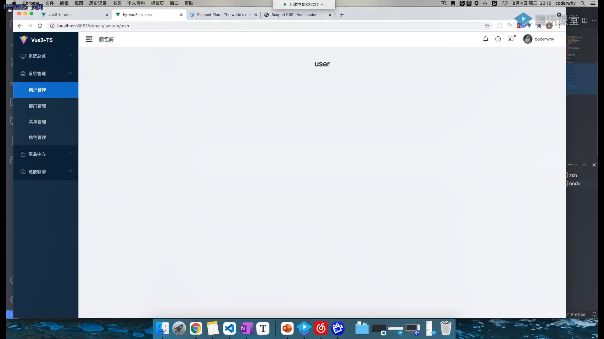

# Main



## 实现步骤

1. 基础页面结构搭建
   1. 整个的文件结构

   ```md
   |-- components

      |-- nav-main(放左侧导航栏的文件)
        |-- src
          |--nav-main.vue
        |--index.ts(主要的文件导出文件)

      |-- nav-header（头部导航栏的文件）

   |-- views
      |-- main
           |-- main.vue(主要导入文件)
   ```

   ```
        |-- config 
            相关配置文件
        |-- hooks 
            相关使用生命周期函数或者reative的配置文件
        |-- cpns
            分为多个组件
            |-- login-panel.vue
                
            |-- login-account.vue 
            |-- login-phone.vue
                实现登录验证的逻辑及正则提醒
   ```

   el-plus menu 的结构

   ``` html
   <!-- el-menu 里面可以写菜单相关样式，及绑定open之类操作 -->
   <el-menu>
        <el-sub-menu index="1">
          <!-- 一级菜单内容 -->
          <template #title>
            <!-- <el-icon><location /></el-icon> -->
            <span>Navigator One</span>
          </template>

          <!-- <el-menu-item-group title="Group One"> 分组 -->
            <el-menu-item index="1-1">item one</el-menu-item>
            <el-menu-item index="1-2">item two</el-menu-item>
          <!-- </el-menu-item-group> -->
            <el-menu-item index="1-3">item three</el-menu-item>
            <!-- 每个item外面套一个sub-menu代表可以展开 -->
          <el-sub-menu index="1-4">
            <template #title>item four</template>
            <el-menu-item index="1-4-1">item one</el-menu-item>
          </el-sub-menu>
        </el-sub-menu>

        <!-- 如果到达el-menu-item 就是没有展开啦 -->
        <el-menu-item index="2">
          <el-icon><icon-menu /></el-icon>
          <span>Navigator Two</span>
        </el-menu-item>

        <el-menu-item index="3" disabled>
          <!-- <el-icon><document /></el-icon> -->
          <span>Navigator Three</span>
        </el-menu-item>

        <el-menu-item index="4">
          <!-- <el-icon><setting /></el-icon> -->
          <span>Navigator Four</span>
        </el-menu-item>
        
      </el-menu>
      ```

## RBAC

(role base accsess control)

动态路由组件
方案：

1. 注册全部路由
2. 不同角色注册不同路由表
3. 根据菜单动态生成路由映射
   1. 在哪里配置动态路由
      1. store/router的路由守卫都可以
   2. 在store中配置
      1. 先加载所有路由
         1. require.context('路径',Boolean，正则);
         2. 返回合规的文件路径，Boolean：是否递归查找
      2. 根据获取菜单选择

### 为什么配置完刷新页面就not-found？

执行顺序：

1. vueRouter：app.user(router) -> install(){} ->获取当前path -> router.routes ->
2. setupStore() ->注册动态路由
3. 路由守卫回调


## 页面搭建

### 高级组件封装

#### 搜索框

* 实现内容：

  

  * 基本样式实现


  * 可根据传入props配置所需表单内容
    1. 可自定义input框的类型
    2. 可自定义样式
       1. label-width...
       2. margin\padding\width
    3. 样式抽离
    4. Q：怎么把我们写el-form的属性提醒作为类型提出来呢？这样就不用写一堆lineWidth这种了
   
### 面包屑 & default-active
  * 怎么动态绑定Form-item的default-active？
    1. 根据我的路由地址去匹配menu，得到item.id =>default-active
       1. 获取路由地址
          ```ts
          const currentPath = useRoute().path
          ```

          *uesRoute() 和 useRouter() 的差别*
             * route 是一个路由对象，每个路由都有对应的路由对象，是一个局部的对象；可用于获取对应的name、path、params、query等
             * router 是VueRouter的一个全局对象，通过`Vue.use(VueRouter)和VueRouter构造函数`得到一个*router的实例对象*，他包含了所有的路由包含了许多关键的对象和属性。

       2. 匹配menu
       3. 如果path为‘/main’，就映射到第一个item的路径上


    2. 面包屑可根据同一思路：
       1. 在此基础上，保存上级组件名字

```vue
    // 因为itemNames是依托下列条件变Q:化的属性，所有要用计算属性包裹；
    // 这也是为什么要以参数形式传输path和menu的原因；方便监听其变化
    // Q:computed的原理是什么？
    const itemNames = computed(() => {
      const menu = store.state.loginModule.userMenu
      const currentPath = useRoute().path
      const menuName = getParentMenu(menu, currentPath)
      return menuName
    })
```

### 双向绑定表单

### 表格 table组件
1. store & request：请求（用户菜单）的数据
2. 使用el的table组件：传入两个props：menu的数据、每个column的参数整合（listProps[]）；生成表格
3. 调整表格样式
4. 对表格的某些列进行特殊处理：如转化为一个加粗或者button、又或者对数据进行处理
   1. 通过插槽进行状态按钮管理、时间转换
   2. 可选项
      1. 序号列
      2. 选择列
      3. 数据增删列
   3. header & footer 插槽
5. ts对全局变量的报错: src/types/filter.d.ts
   ```ts
   import { filters } from '@/global/register-globalVarias'
   declare module '@vue/runtime-core' {
     export interface ComponentCustomProperties {
       $filters: typeof filters
     }
   }
 ```
   

#### remain question：
* 怎么把我们写el-form的属性提醒作为类型提出来呢？这样就不用写一堆lineWidth这种了
* computed的原理？
* 表格插槽问题：为啥一定要写这个 :row="scope.row"
  ```vue
          <el-table-column v-bind="column" align="center">
          <template #default="scope">
            <!-- 为啥一定要写这个 :row="scope.row" -->
            <slot :name="column.slotName" :row="scope.row">
              {{ scope.row[column.prop] }}
            </slot>
          </template>
        </el-table-column>
  ```
